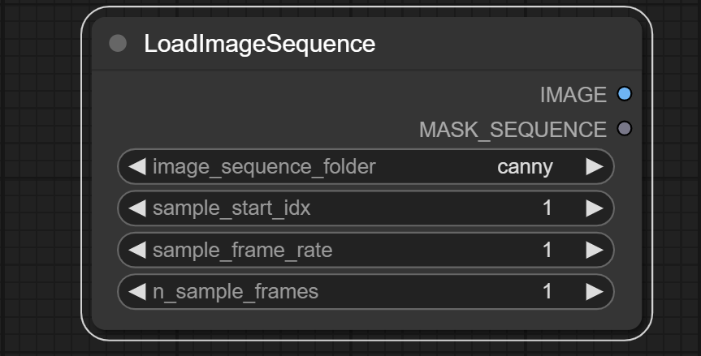
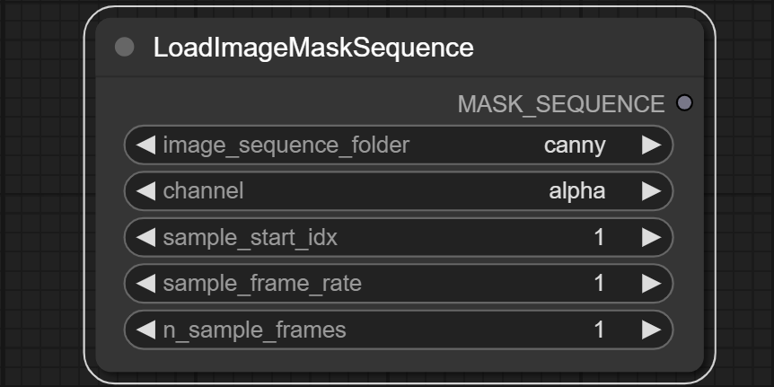
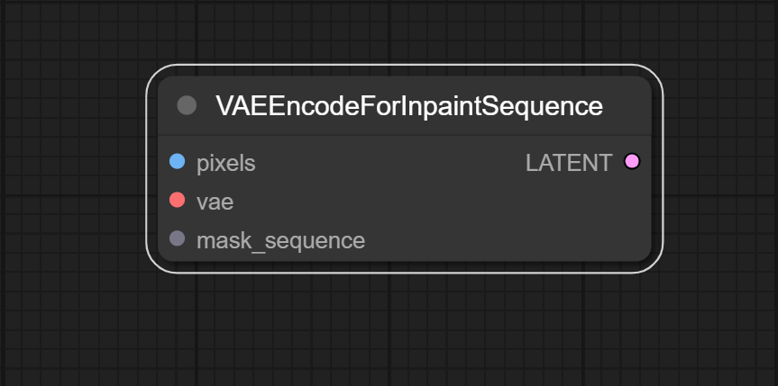
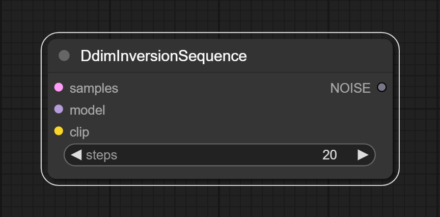
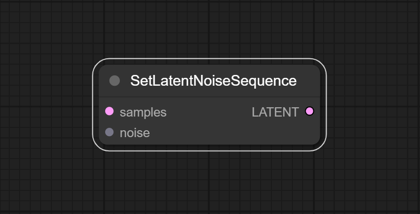
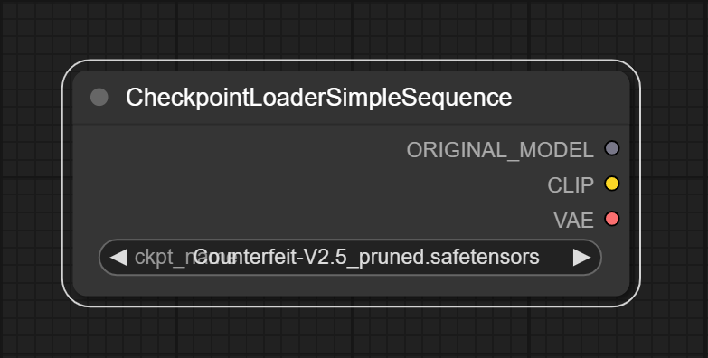
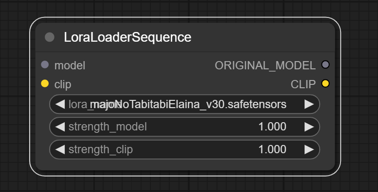
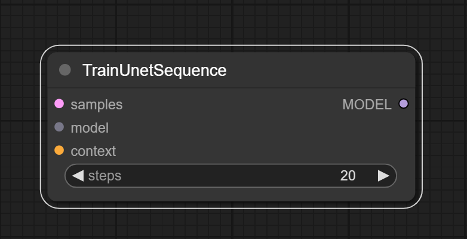
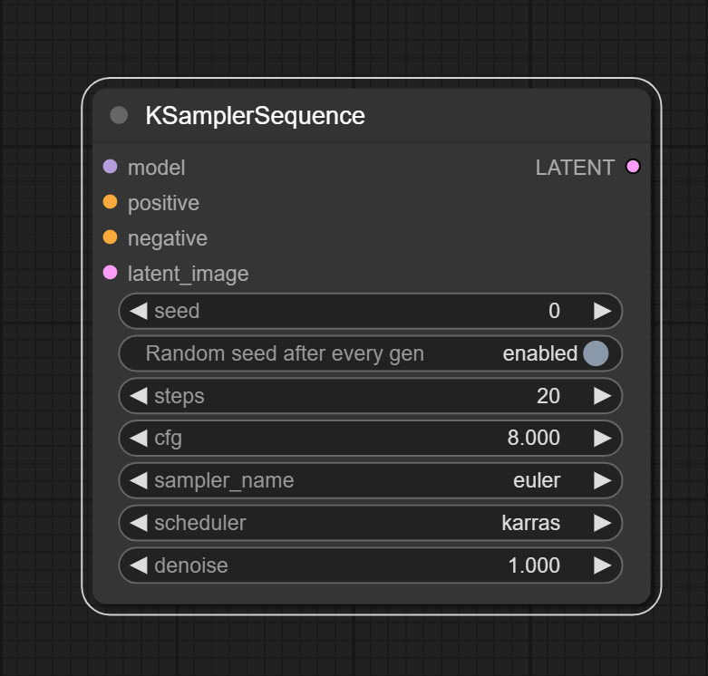

# Vid2vid Node Suite for [ComfyUI](https://github.com/comfyanonymous/ComfyUI)

A node suite for ComfyUI that allows you to load image sequence and generate new image sequence with different styles or content.

Original repo: https://github.com/sylym/stable-diffusion-vid2vid <br>

## Install
Firstly, [install comfyui](https://github.com/comfyanonymous/ComfyUI)

Then run:
```sh
cd ComfyUI/custom_nodes
git clone https://github.com/sylym/comfy_vid2vid
cd comfy_vid2vid
```
Next, download dependencies:
```sh
python -m pip install -r requirements.txt
```
For ComfyUI portable standalone build:
```sh
#You may need to replace "..\..\..\python_embeded\python.exe" depends your python_embeded location
..\..\..\python_embeded\python.exe -m pip install -r requirements.txt
```

## Usage
All nodes are classified under the vid2vid category.

## Nodes

### LoadImageSequence


Load image sequence from a folder.

**Inputs:**
- None

**Outputs:**
- IMAGE
  - Image sequence

- MASK_SEQUENCE
  -  The alpha channel of the image sequence is the channel we will use as a mask.

**Parameters:**
- image_sequence_folder
  - Select the folder that contains a sequence of images.  Node only uses folders in the `input` folder. 
  - The folder should only contain images with the same size.

- sample_start_idx
  - The start index of the image sequence. The image sequence will be sorted by image names.

- sample_frame_rate
  - The frame rate of the image sequence. If the frame rate is 2, the node will sample every 2 images.

- n_sample_frames
    - The number of images in the sequence. The number of images in `image_sequence_folder` must be greater than or equal to `sample_start_idx - 1 + n_sample_frames * sample_frame_rate`.
    - If you want to use the node `CheckpointLoaderSimpleSequence` to generate a sequence of pictures, set `n_sample_frames` >= 3.

---
### LoadImageMaskSequence


Load mask sequence from a folder.

**Inputs:**
- None

**Outputs:**
- MASK_SEQUENCE
    -  Image mask sequence

**Parameters:**
- image_sequence_folder
  - Select the folder that contains a sequence of images.  Node only uses folders in the `input` folder. 
  - The folder should only contain images with the same size.

- channel
    - The channel of the image sequence that will be used as a mask.

- sample_start_idx
    - The start index of the image sequence. The image sequence will be sorted by image names.

- sample_frame_rate
    - The frame rate of the image sequence. If the frame rate is 2, the node will sample every 2 images.

- n_sample_frames
    - The number of images in the sequence. The number of images in `image_sequence_folder` must be greater than or equal to `sample_start_idx - 1 + n_sample_frames * sample_frame_rate`.

---
### VAEEncodeForInpaintSequence


Encode the input image sequence into a latent vector using a Variational Autoencoder (VAE) model. Also add image mask sequence to latent vector.

**Inputs:**
- pixels: IMAGE
    - Image sequence that will be encoded.

- vae: VAE
    - VAE model that will be used to encode the image sequence.

- mask_sequence: MASK_SEQUENCE
    - Image mask sequence that will be added to the latent vector. The number of images and masks must be the same.

**Outputs:**
- LATENT
    - The latent vector with image mask sequence. The image mask sequence in the latent vector will only take effect when using the node `KSamplerSequence`.

**Parameters:**
- None

---
### DdimInversionSequence


Generate a specific noise vector by inverting the input latent vector using the Ddim model. Usually used to improve the time consistency of the output image sequence.

**Inputs:**
- samples: LATENT
    - The latent vector that will be inverted.

- model: MODEL
    - Full model that will be used to invert the latent vector.

- clip: CLIP
    - Clip model that will be used to invert the latent vector.

**Outputs:**
- NOISE
    - The noise vector that will be used to generate the image sequence.

**Parameters:**
- steps
    - The number of steps to invert the latent vector.

---
### SetLatentNoiseSequence


Add noise vector to latent vector.

**Inputs:**
- samples: LATENT
    - The latent vector that will be added noise.

- noise: NOISE
    - The noise vector that will be added to the latent vector.

**Outputs:**
- LATENT
    - The latent vector with noise. The noise vector in the latent vector will only take effect when using the node `KSamplerSequence`.

**Parameters:**
- None

---
### CheckpointLoaderSimpleSequence


Load the checkpoint model into UNet3DConditionModel. Usually used to generate a sequence of pictures with time continuity.

**Inputs:**
- None

**Outputs:**
- ORIGINAL_MODEL
    - Model for fine-tuning, not for inference

- CLIP
    - The clip model

- VAE
    - The VAE model

**Parameters:**
- ckpt_name
    - The name of the checkpoint model. The model should be in the `models/checkpoints` folder.

---
### LoraLoaderSequence


Same function as `LoraLoader` node, but acts on UNet3DConditionModel. The input and output of the model are both of `ORIGINAL_MODEL` type.

---
### TrainUnetSequence


Fine-tune the incoming model using latent vector and context, and convert the model to inference mode.

**Inputs:**
- samples: LATENT
    - The latent vector that will be used to fine-tune the incoming model.

- model: ORIGINAL_MODEL
    - The model that will be fine-tuned.

- context: CONDITIONING
    - The context that will be used to fine-tune the incoming model.

**Outputs:**
- MODEL
    - The fine-tuned model. This model is ready for inference.

**Parameters:**
- steps
    - The number of steps to fine-tune the model. If the steps is 0, the model will not be fine-tuned.

---
### KSamplerSequence


Same function as `KSampler` node, but added support for noise vector and image mask sequence.


## Limits
- UNet3DCoditionModel has high demand for GPU memory. If you encounter out of memory error, try to reduce `n_sample_frames`. However, `n_sample_frames` must be greater than or equal to 3.


- Some custom nodes do not support processing image sequences. The nodes listed below have been tested and are working properly:
    - [Official node](https://github.com/comfyanonymous/ComfyUI)
    - [comfy_controlnet_preprocessors](https://github.com/Fannovel16/comfy_controlnet_preprocessors)